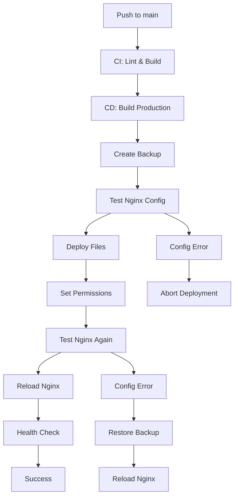
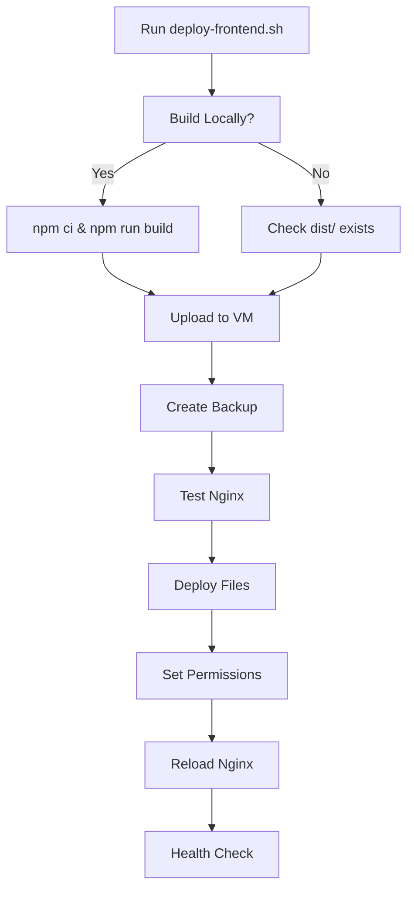

# Frontend Deployment Guide

This guide covers the deployment setup for the Nutri Glass frontend to Azure VM using GitHub Actions and manual deployment options.

## Overview

The deployment system includes:
- **CI Pipeline**: Code quality checks and build validation
- **CD Pipeline**: Automated deployment to Azure VM
- **Manual Deployment**: Script for local deployments
- **Nginx Integration**: Proper web server management

## Prerequisites

### GitHub Secrets

Configure these secrets in your GitHub repository settings:

```
HOST=your-azure-vm-ip-or-domain
USERNAME=azureuser
SSH_KEY=your-private-ssh-key
```

### Azure VM Setup

Ensure your Azure VM has:
- Nginx installed and configured
- Node.js 20+ (for any server-side operations)
- Proper directory structure: `/var/www/bitewise/`
- SSH access configured
- Sudo privileges for the deployment user

## Deployment Methods

### 1. Automatic Deployment (GitHub Actions)

Triggers automatically on:
- Push to `main` branch
- Merged pull requests to `main`

**Workflow:**
1. **CI Pipeline** (`.github/workflows/ci.yml`):
   - Runs on all pushes and PRs
   - Lints code
   - Builds project
   - Validates build output

2. **CD Pipeline** (`.github/workflows/cd.yml`):
   - Runs only on main branch changes
   - Builds production assets
   - Creates backup of current deployment
   - Tests nginx configuration
   - Deploys new files
   - Reloads nginx
   - Runs health checks
   - Automatic rollback on failure

### 2. Manual Deployment

Use the provided script for manual deployments:

```bash
# Build and deploy
./deploy-frontend.sh --build

# Deploy pre-built files
./deploy-frontend.sh

# Deploy without backup
./deploy-frontend.sh --no-backup

# Get help
./deploy-frontend.sh --help
```

**Environment Variables:**
```bash
export DEPLOY_HOST=your-domain.com
export DEPLOY_USER=azureuser
./deploy-frontend.sh --build
```

## Nginx Configuration

### Do You Need to Restart Nginx?

**Short Answer:** Usually **NO** - we use `nginx reload` instead.

**Detailed Answer:**
- **`nginx reload`**: Gracefully reloads configuration without dropping connections
- **`nginx restart`**: Stops and starts nginx, briefly interrupting service
- **When to restart**: Only when nginx won't start or has major configuration changes

Our deployment automatically:
1. Tests nginx configuration before deployment
2. Uses `systemctl reload nginx` (graceful reload)
3. Tests configuration after deployment
4. Rolls back if configuration is invalid

### Sample Nginx Configuration

```nginx
server {
    listen 80;
    listen 443 ssl;
    server_name bitewise.twiggle.tech;

    # SSL configuration
    ssl_certificate /path/to/your/certificate.crt;
    ssl_certificate_key /path/to/your/private.key;

    # Frontend
    location / {
        root /var/www/bitewise;
        try_files $uri $uri/ /index.html;
        
        # Cache static assets
        location ~* \.(js|css|png|jpg|jpeg|gif|ico|svg)$ {
            expires 1y;
            add_header Cache-Control "public, immutable";
        }
    }

    # Backend API
    location /api/ {
        proxy_pass http://127.0.0.1:8000;
        proxy_set_header Host $host;
        proxy_set_header X-Real-IP $remote_addr;
        proxy_set_header X-Forwarded-For $proxy_add_x_forwarded_for;
        proxy_set_header X-Forwarded-Proto $scheme;
    }
}
```

## Deployment Flow

### Automatic Deployment (GitHub Actions)



### Manual Deployment



## Troubleshooting

### Common Issues

1. **Build Failures**
   ```bash
   # Check build locally
   npm run build
   
   # Check for linting errors
   npm run lint
   ```

2. **Deployment Failures**
   ```bash
   # Check nginx status
   sudo systemctl status nginx
   
   # Test nginx configuration
   sudo nginx -t
   
   # Check logs
   sudo journalctl -u nginx -f
   ```

3. **Permission Issues**
   ```bash
   # Fix permissions manually
   sudo chown -R www-data:www-data /var/www/bitewise/
   sudo chmod -R 755 /var/www/bitewise/
   ```

4. **SSH Issues**
   ```bash
   # Test SSH connection
   ssh azureuser@your-vm-ip
   
   # Check SSH key permissions
   chmod 600 ~/.ssh/id_rsa
   ```

### Recovery Procedures

1. **Automatic Rollback**: The CD pipeline automatically restores from backup if deployment fails
2. **Manual Rollback**:
   ```bash
   # Find available backups
   ls -la /var/www/bitewise-backup-*
   
   # Restore from backup
   sudo rm -rf /var/www/bitewise/*
   sudo cp -r /var/www/bitewise-backup-YYYYMMDD-HHMMSS/* /var/www/bitewise/
   sudo chown -R www-data:www-data /var/www/bitewise/
   sudo systemctl reload nginx
   ```

## Monitoring

### Health Checks

The deployment includes automatic health checks:
- Local nginx test
- External accessibility test
- SSL certificate validation (if configured)

### Logs

Monitor deployment logs:
```bash
# GitHub Actions logs (in repository)
# Nginx access logs
sudo tail -f /var/log/nginx/access.log

# Nginx error logs
sudo tail -f /var/log/nginx/error.log

# System logs
sudo journalctl -u nginx -f
```

## Security Considerations

1. **SSH Keys**: Use dedicated deployment keys, not personal keys
2. **Permissions**: Frontend files should be owned by `www-data:www-data`
3. **Backups**: Automatic cleanup keeps only last 5 backups
4. **SSL**: Ensure SSL certificates are properly configured
5. **Firewall**: Only expose necessary ports (80, 443, 22)

## Performance Optimization

1. **Build Optimization**: The build process includes:
   - Tree shaking
   - Code splitting
   - Asset optimization

2. **Nginx Optimization**: Configure:
   - Gzip compression
   - Static file caching
   - Connection keep-alive

3. **Monitoring**: Consider adding:
   - Performance monitoring
   - Error tracking
   - Analytics

## Backend Coordination

Since your backend and frontend are in separate repositories:

1. **Backend deploys first** (via its own CD pipeline)
2. **Frontend deploys after** backend is stable
3. **API compatibility** should be maintained during deployments
4. **Database migrations** should be backward compatible

## Environment Variables

For different environments, you can override:

```bash
# Production
export DEPLOY_HOST=bitewise.twiggle.tech
export DEPLOY_USER=azureuser

# Staging
export DEPLOY_HOST=staging.bitewise.twiggle.tech
export DEPLOY_USER=azureuser

./deploy-frontend.sh --build
```