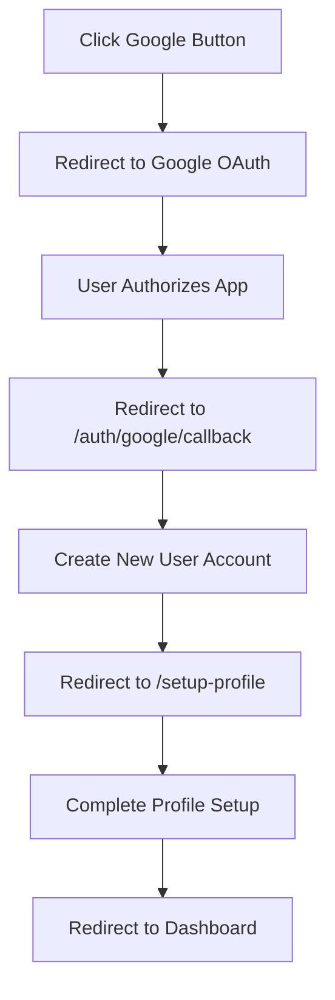
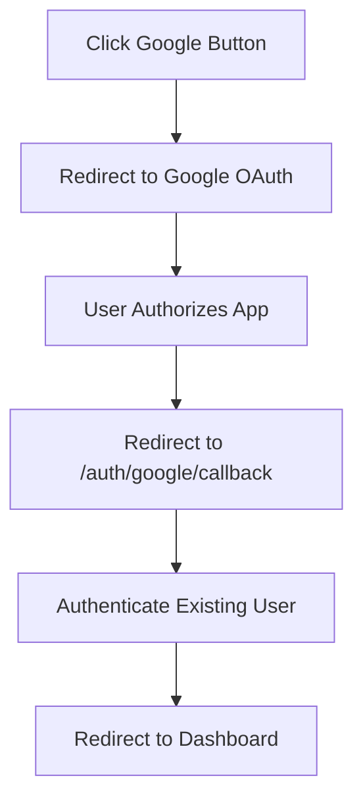

# Google OAuth Authentication - Implementation Guide

## 🎯 Overview

The BiteWise frontend now supports Google OAuth authentication, allowing users to sign in with their Google accounts. This implementation provides a seamless authentication experience and reduces friction for new users.

## ✅ What's Been Implemented

### 1. API Layer Integration
- **Location**: `src/lib/api.ts`
- **New Endpoints**: 
  - `GET /auth/google/login` - Initiates OAuth flow
  - `POST /auth/google/callback` - Processes OAuth callback
- **Types**: Complete TypeScript interfaces for Google OAuth responses

### 2. React Hooks
- **Location**: `src/hooks/useAuth.ts`
- **New Hooks**:
  - `useGoogleLogin()` - Handles OAuth initiation
  - `useGoogleCallback()` - Processes OAuth callback

### 3. UI Components

#### Enhanced Login Page (`src/pages/Index.tsx`)
- ✅ Functional Google login button
- ✅ Loading states and error handling
- ✅ Integrated with existing authentication flow

#### Google Callback Handler (`src/pages/GoogleCallback.tsx`)
- ✅ Processes OAuth redirect from Google
- ✅ Handles success/error states with user feedback
- ✅ Smart routing based on user status

#### Profile Setup Page (`src/pages/SetupProfile.tsx`)
- ✅ Complete profile setup form for new Google users
- ✅ Form validation and error handling
- ✅ Option to skip setup for quick access

### 4. Routing System
- **Location**: `src/App.tsx`
- **New Routes**:
  - `/auth/google/callback` - OAuth callback processor
  - `/setup-profile` - Profile completion for new users

## 🔄 User Authentication Flow

### First-Time Google User


### Returning Google User


## 🛠 Technical Implementation Details

### Security Features
- **CSRF Protection**: State parameter with timestamp-based validation
- **Token Management**: Seamless integration with existing token storage
- **Error Handling**: Comprehensive error catching and user feedback

### Code Example - Google Login Button
```tsx
const { googleLogin, isLoading: isGoogleLoading } = useGoogleLogin({
  onSuccess: (data) => {
    window.location.href = data.authorization_url;
  },
  onError: (error) => {
    toast.error("Google authentication failed", {
      description: error.message,
    });
  },
});

const handleGoogleLogin = () => {
  const redirectUri = `${window.location.origin}/auth/google/callback`;
  const state = btoa(JSON.stringify({ timestamp: Date.now() }));
  googleLogin({ redirectUri, state });
};
```

## 📋 Backend API Requirements

The frontend expects these backend endpoints to be implemented:

### Google Login Endpoint
```http
GET /api/v1/auth/google/login?redirect_uri=<uri>&state=<state>

Response:
{
  "authorization_url": "https://accounts.google.com/oauth/authorize?...",
  "state": "security_state_string"
}
```

### Google Callback Endpoint
```http
POST /api/v1/auth/google/callback
Content-Type: application/json

{
  "code": "authorization_code_from_google",
  "state": "state_parameter"
}

Response:
{
  "user_id": "string",
  "email": "string",
  "username": "string", 
  "access_token": "string",
  "refresh_token": "string",
  "expires_in": 3600,
  "token_type": "Bearer",
  "provider": "google",
  "first_login": boolean,
  "profile_complete": boolean,
  "setup_required": boolean
}
```

## 🧪 Testing Instructions

### Prerequisites
1. Backend Google OAuth endpoints implemented
2. Google OAuth client configured in backend
3. Frontend development server running

### Test Cases
1. **New User Flow**:
   - Click Google login button
   - Complete OAuth consent
   - Verify redirect to profile setup
   - Complete or skip profile setup
   - Verify dashboard access

2. **Existing User Flow**:
   - Click Google login button
   - Complete OAuth consent  
   - Verify direct redirect to dashboard

3. **Error Scenarios**:
   - Cancel OAuth consent
   - Network failure during OAuth
   - Invalid backend responses

## 🎨 User Experience Features

### Visual Feedback
- ✅ Loading spinners on buttons during OAuth flow
- ✅ Toast notifications for success/error states
- ✅ Clear status messages during callback processing
- ✅ Disabled states prevent double-clicking

### Error Handling
- ✅ User-friendly error messages
- ✅ Automatic redirect to login on failures
- ✅ Graceful handling of cancelled OAuth

## 🔧 Configuration

### Environment Variables
```env
VITE_API_BASE_URL=http://localhost:8000
```

### Google OAuth Setup (Backend)
The backend needs to be configured with:
- Google OAuth Client ID
- Google OAuth Client Secret  
- Authorized redirect URIs including `{frontend_url}/auth/google/callback`

## 🚀 Next Steps & Future Enhancements

### Immediate Backend Work Needed
1. Implement the two Google OAuth API endpoints
2. Configure Google OAuth credentials
3. Set up proper CORS for the callback URL

### Future Feature Possibilities
- Apple Sign-In integration (UI button already present)
- Account linking for existing email users
- Google profile data pre-filling in setup form
- Account unlinking functionality
- Social features integration

## 🐛 Troubleshooting

| Issue | Possible Cause | Solution |
|-------|---------------|----------|
| Google button not working | Backend endpoints missing | Implement API endpoints |
| Callback page errors | Invalid OAuth configuration | Check Google OAuth setup |
| Redirect loops | Incorrect route configuration | Verify App.tsx routes |
| Token not stored | API response format mismatch | Check response structure |

## 📁 Files Modified/Created

### Modified Files
- `src/lib/api.ts` - Added Google OAuth API integration
- `src/hooks/useAuth.ts` - Added Google OAuth hooks
- `src/pages/Index.tsx` - Enhanced Google login button
- `src/App.tsx` - Added new routes

### New Files
- `src/pages/GoogleCallback.tsx` - OAuth callback handler
- `src/pages/SetupProfile.tsx` - Profile setup for new users

---

**Status**: ✅ Frontend implementation complete, ready for backend integration
**Last Updated**: Current session 